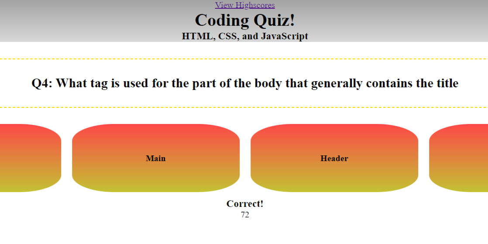

# Code-Quiz

## Description

This was the fourth challenge issued to me by the Wash U Coding Bootcamp. The assignment was to create a coding quiz game that would have a timer, take time off for wrong answers, and be able to save high scores. This was an even numbered challenge, so we were given no starter code and everything was done from scratch

I learned of lot about working with Javascript while working on this assignment, such as use of event listeners, and the importance of removing said event listeners when their job is done. There was a lot of trial and error during the development that pushed me to think different and tackle the various issues I was dealing with with different approaches; issues such as the points for right and wrong answers not adding up properly, due to the event listeners still existing from previous questions, or having issues getting the timer display to update to reflect the loss of time when a question is answered incorrectly. I also got to get some more practice in working on the html and css from scratch for a page.

## Installation

N/A, it's a webpage.

## Usage

The webpage can be found [here](https://wolfspiderman.github.io/Code-Quiz/).

The Start Button under the title will start the quiz, as well as the timer. The first question will appear in the dotted-gold-bordered box, and the multiple choice answer options will appear on their buttons. The timer will be displayed under the answer choices while the timer is active. This is also where notifications will appear when a question is answered correctly or incorrectly. If the question is answered incorrectly, 15 additional seconds will be taken off the timer. If the timer hits 0, the game will end. If the player answers all questions, they will be shown their final score, and, if there is no high score previously saved in the local storage, or they set a new high score, they will be prompted to leave their initials. The high score and initials can be recalled by clicking the highscore button at the top of the page.

The following is a screenshot of what the page looks like while the quiz is running:

## Credits

I was given the assignment to create this project by Washington University St. Louis's Coding Boot Camp.

For this project, I used the lesson materials from the Boot Camp, as well as the MDN references for [timers](https://developer.mozilla.org/en-US/docs/Web/API/setInterval), [event listeners](https://developer.mozilla.org/en-US/docs/Web/API/EventTarget/addEventListener), and [local storage](https://developer.mozilla.org/en-US/docs/Web/API/Window/localStorage) to guide me in utilizing JavaScript to create this quiz.

## License

Licensed under the MIT License.